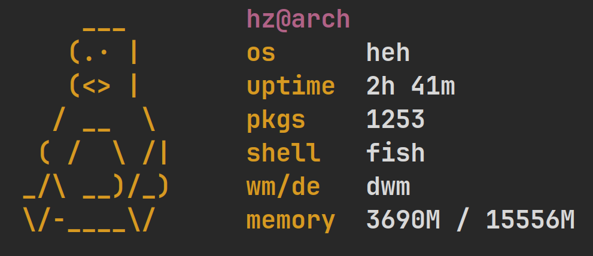

A simple fetch written in C, similar to pfetch, but with display of more important systhem parameters.



## Installation

```bash
git clone https://github.com/hehhzqq/hehfetch.git
cd hehfetch
sudo sh build
```

After installation, you can delete the directory cloned with git and use hehfetch:

```bash
hehfetch
```
